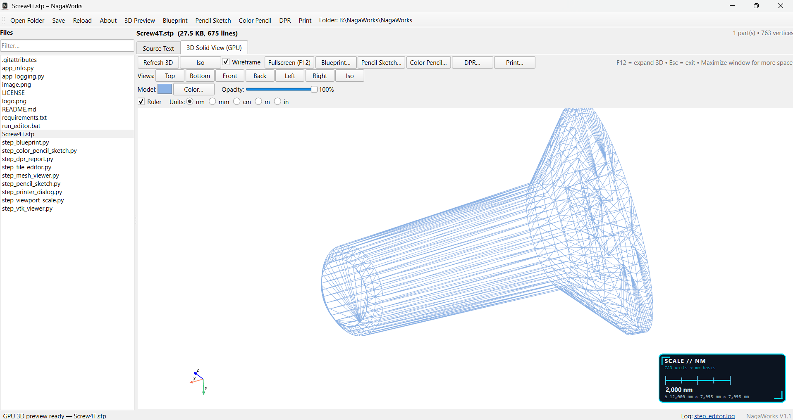
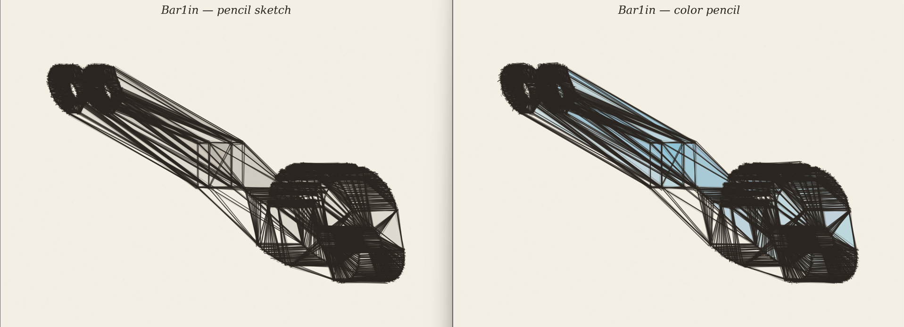
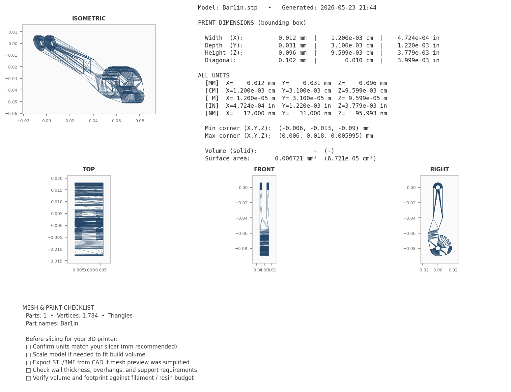

# NagaWorks STEP File Editor V1.1

Desktop application to **view and edit STEP (`.stp` / `.step`) files** with a GPU-accelerated 3D solid preview, technical blueprint export, and pencil-sketch images.

Published by **NagaSoftLabs.com** · [Naga Soft Labs](https://nagasoftlabs.com/)





---

## Features

- **Source text editor** — Open, edit, and save STEP files as text (UTF-8)
- **3D solid view (GPU)** — Interactive VTK/PyVista viewport with orbit, zoom, and pan
- **Standard views** — Top, bottom, front, back, left, right, isometric
- **Appearance** — Model color picker and opacity slider
- **Wireframe** — Toggle wireframe rendering
- **Expanded 3D view** — F12 hides side panels so the model uses more of the window (Esc to exit)
- **Blueprint export** — 2×2 orthographic sheet (Top, Front, Right, Isometric) as PNG, PDF, or SVG
- **Pencil sketch export** — Hand-drawn style isometric image as PNG, JPEG, or PDF
- **File browser** — Filterable list of files in the current folder
- **Logging** — Diagnostics and crash info written to `logs/step_editor.log`

---

## Requirements

- **Python 3.10+** (tested on Python 3.14 / Windows)
- **GPU** recommended for smooth 3D (OpenGL via VTK)
- Dependencies listed in `requirements.txt`:
  - PySide6, PyVista, VTK, trimesh, cascadio, matplotlib, numpy

---

## Quick start

### Windows

```bat
run_editor.bat

This installs dependencies and launches the editor.
cd NagaWorks
pip install -r requirements.txt
set QT_API=pyside6
python step_file_editor.py

Open a file or folder on startup
python step_file_editor.py

